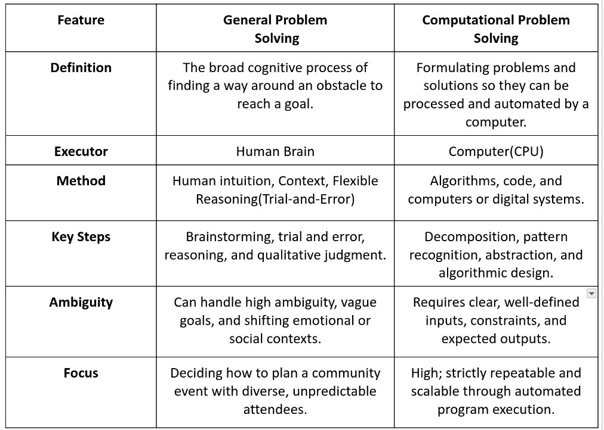

# Introduction to Data Structures and Algorithms
<BR>

Data is any form that is stored in a computer (meaning data exists in many forms like text, numbers, shapes etc).
Computers cannot work without data.
#### To transform data(raw information) into meaningful results, the computer carries out these tasks:

  * Input - Input devices
  * Storing - Memory
    ```
    ├── Main - Stores data temporarily
    └──Secondary - Stores data consistently
    ```
  * Processing - Processor
  * Output - Output devices
  * Communication - Network Interface Card (NIC)
<BR>
Computers cannot execute those tasks without step by step instructions. Programs are step by step instructions that tell a computer what to do.
Programs consists of:

```
|   ├──Data
|   └──Instructions
```
To run algorithms effectively, programs rely on Data Structures.
Data Structures are concerned with the main memory. They help organize and store data.

#### Data Structures are program constructs that are there to help store and structure data.
Once the data is clearly structured, the focus shifts from how information is stored to how decisions are made. 
<BR>

### General Problem-Solving
* Understanding the Problem
    * What is it?
    * What caused it?
    * What are the impacts of the problem?
* Plan
    * How to solve the problem
    * Decide what action to take
    * If you have variations, compare them and decide.

* Execution Plan/Take Action
    * Develop a solution
<BR>

While General problem solving requires human-intuition, context and flexible reasoning, for computers, solutions must be translated to unambiguous steps that a machine can execute without an error.
<BR>

### Computational Problem-Solving:

#### Step 1: Analysis (Understand the Problem)
Do analysis to get the requirements(system requirements).
<BR>
Example of Problem: Solve Simple Interest
* What is it? amount, time, rate
* input: amount, time, rate
* What to store: amount, time, rate
* Processing: Interest=(amountxtimexrate)/100
* Output: Interest

<BR>

#### Step 2: Design(Plan)
When you State the design clearly, that's an algorithm.
<BR>
Solve Simple Interest Design:
1. Start
2. Read amount, time, rate
3. Compute Interest=(amountxtimexrate)/100
4. Write Interest
5. Store
   
<BR>

An algorithm is precise(steps are clear) and sequential(step by step)
#### Algorithms are precise sequences carried out by a computer in finite time.
<BR>

### Characteristics of Algorithms
* Precise
* Sequential
* Computable
* Finite - has a beginning and end.
* Independent - Any platforms or computers can be used
  
<BR>

Why we don't use natural languages in creating instructions:
* Ambiguous
* Bulky - So many words are used
* Natural language keeps changing
<BR>

#### Step 3: Coding (Implementation)
Coding is transforming design into a certain programming language.
<BR>

### Differences between General Problem-Solving and Computational Problem-Solving .
<div style="align:center">

</div>

<BR>

### Factors Affecting the Performance of a Computers
```text
   Hardware
|    ├──Processor
|    └──I/O devices
|    └──Channels
   Software
|    ├──Operating System
|    └──Utility Software
|    └──App/System that you created
|         ├──Programming Language
|         └──Data structures
```
<BR>
Using low-level languages for critical systems is important because they provide direct hardware control, maximum execution speed, and precise memory management without the overhead of abstraction layers
<BR>

### Common Algorithms
``` text
Algorithms
├── intrinsic 
 │    ├── Numeric (e.g., Floating, Integral)
 │    └── Non-numeric(e.g., Char, Boolean)
 └── Data Structures (No backbone)
 |     ├── Structured - organized in a certain way
 |         ├── Linear
 |              └── Restricted (e.g., Queue, Stack)
 |              └── Unrestricted (e.g., Arrays, Lists, Linked Lists)
 |         ├── Non-linear (e.g., Tree, HashTable, Map)
```


  
